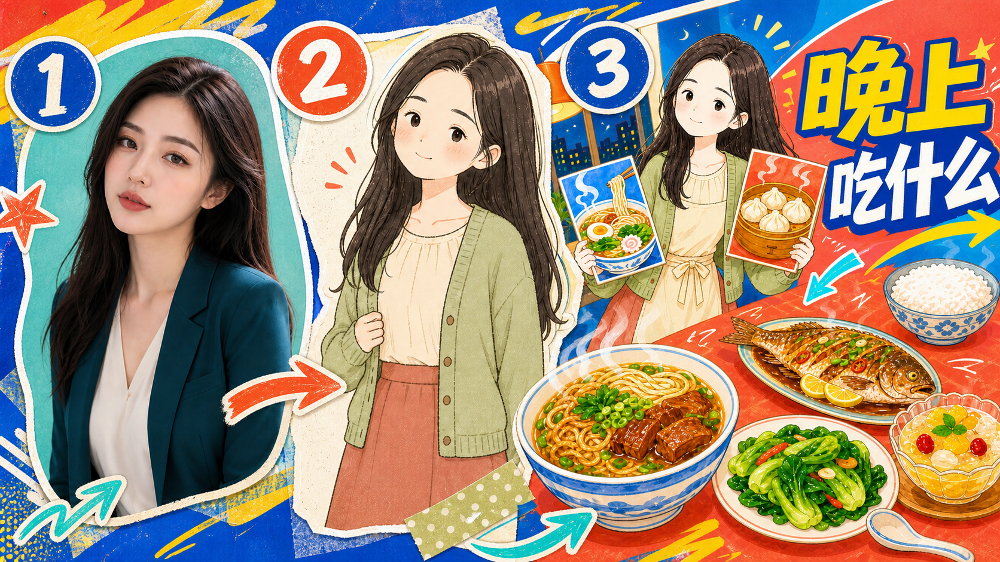

# IP Master

角色注册、外部设计 Skill 路由与身份参考注入。IP Master 本身不生图，
也不复制上游 Skill；它只把明确选择的角色原图交给明确选择的外部 Skill。

## 内置 IP

| 牙仔（默认） | 绒宝 | 阿龅 | 小美 |
| --- | --- | --- | --- |
|  |  |  |  |
| `yazai` / 牙仔<br>[身份图](ip-master/assets/characters/yazai.webp) · [协议](ip-master/references/characters/yazai.md) | `rongbao` / 绒宝<br>[身份图](ip-master/assets/characters/rongbao.webp) · [协议](ip-master/references/characters/rongbao.md) | `abao` / 阿龅<br>[身份图](ip-master/assets/characters/abao.webp) · [协议](ip-master/references/characters/abao.md) | `xiaomei` / 小美<br>[身份图](ip-master/assets/characters/xiaomei.webp) · [协议](ip-master/references/characters/xiaomei.md) |

写中文名或英文别名即可选择角色；同时写多个名称会按注册顺序分别注入。
未写角色但已明确外部目标时使用默认牙仔。新增角色必须经过用户确认，见
[注册流程](ip-master/scripts/register_character.py)。

## IP 设计类 Skill

| Skill | 风格数量 | 风格摘要 | 触发 |
| --- | ---: | --- | --- |
| [`personal-ip-image-pack`](https://github.com/DoraRabbitYan/personal-ip-image-pack) | 6 | IP-01 至 IP-06；真人照片→个人卡通 IP→表情、动作、贴纸包 | 真人照片、本人卡通形象、博主形象 |
| [`ip-illustration-character-system`](https://github.com/EverettFish/ip_illustration_for_yourself) | 1 | 萌粒钢笔涂鸦视觉系统 | 角色锚点、三视图、萌粒 |

个人照片包上游未声明许可证；按需安装，不推断许可证、不复制源码或素材。
动物、吉祥物和虚构角色不会误路由到个人照片包。

## 可注入 Skill

### 文章配图

| Skill | 风格数量 | 风格摘要 | 备注 |
| --- | ---: | --- | --- |
| [`ian-xiaohei-illustrations`](https://github.com/helloianneo/ian-xiaohei-illustrations) | 1 | 白底怪诞手绘、红橙蓝批注、大量留白 | 可选；无默认 |
| [`baoyu-article-illustrator`](https://github.com/JimLiu/baoyu-skills/tree/main/skills/baoyu-article-illustrator) | 23 | 细分风格与编辑插画入口，含场景、流程图、信息图 | 可选；无默认 |
| [`ip-illustration-character-system`](https://github.com/EverettFish/ip_illustration_for_yourself) | 1 | 萌粒钢笔涂鸦文章插图 | 可选；需 GPT Image 2 |

### 知识漫画

| Skill | 风格数量 | 风格摘要 |
| --- | ---: | --- |
| [`baoyu-comic`](https://github.com/JimLiu/baoyu-skills/tree/main/skills/baoyu-comic) | 5 | 漫画预设、版式与情绪色调 |

### 封面 / 海报

| Skill | 风格数量 | 风格摘要 |
| --- | ---: | --- |
| [`dongfang-cover-design`](https://github.com/yang0/dongfang) | 6 | 东方美学方向，横版、竖版、方图 |
| [`baoyu-cover-image`](https://github.com/JimLiu/baoyu-skills/tree/main/skills/baoyu-cover-image) | 26 | 风格预设与渲染媒介 |
| [`gbro-cover-design`](https://github.com/pyang5166/gbro-cover-design) | 10 | 3:4 构图风格；只输出封面提示词 |

### 知识卡片 / 信息图

| Skill | 风格数量 | 风格摘要 |
| --- | ---: | --- |
| [`baoyu-infographic`](https://github.com/JimLiu/baoyu-skills/tree/main/skills/baoyu-infographic) | 22 | 信息图风格与结构化版式 |
| [`guizang-social-card-skill`](https://github.com/op7418/guizang-social-card-skill) | 2 | 瑞士风与电子杂志风，含多种卡片布局 |
| [`ip-illustration-character-system`](https://github.com/EverettFish/ip_illustration_for_yourself) | 1 | 萌粒钢笔涂鸦 3:4 信息图 |

### 贴纸 / 角色设定

| Skill | 风格数量 | 风格摘要 |
| --- | ---: | --- |
| [`personal-ip-image-pack`](https://github.com/DoraRabbitYan/personal-ip-image-pack) | 6 | 真人卡通 IP 的表情、动作与贴纸套图 |
| [`ip-illustration-character-system`](https://github.com/EverettFish/ip_illustration_for_yourself) | 1 | 萌粒角色锚点、三视图与 3:4 贴纸页 |

### 小红书 / 公众号 / PPT / 提示词增强

| 用途 | Skill | 风格数量 | 风格摘要 |
| --- | --- | ---: | --- |
| 小红书 | [`baoyu-xhs-images`](https://github.com/JimLiu/baoyu-skills/tree/main/skills/baoyu-xhs-images) | 12 | 基础风格与小红书预设 |
| 小红书、公众号 | [`guizang-social-card-skill`](https://github.com/op7418/guizang-social-card-skill) | 2 | 瑞士风、电子杂志风、公众号封面对 |
| PPT | [`baoyu-slide-deck`](https://github.com/JimLiu/baoyu-skills/tree/main/skills/baoyu-slide-deck) | 17 | 幻灯片视觉风格 |
| 提示词增强 | [`gpt-image-2-style-library`](https://github.com/freestylefly/awesome-gpt-image-2) | 500+ | GPT Image 2 案例模板，只增强提示词，不替换基础 Skill |

普通“文章配图”与多候选场景会先列出可选 Skill；IP Master 不擅自安装或
决定一个默认目标。点名 Skill 后，缺失依赖会展示来源和安装命令，确认后
才由系统安装器处理。完整规则见
[能力路由](ip-master/references/capability-routing.md)和
[角色注入协议](ip-master/references/character-injection.md)。

## 一张范例



## 最小调用

```text
用牙仔做一套知识漫画
用绒宝和阿龅做一张横版封面
用本人照片制作个人卡通 IP，并使用 personal-ip-image-pack
我只想知道文章配图有哪些 Skill（不要安装或生图）
```

脚本入口：[`capability_router.py`](ip-master/scripts/capability_router.py)、
[`dependency_manager.py`](ip-master/scripts/dependency_manager.py)、
[`doctor.py`](ip-master/scripts/doctor.py)。

## 来源与边界

感谢各上游项目维护者。所有可选 Skill 均按需从其公开仓库安装，IP Master
不复制其源码、模板、示例或素材；许可证与来源以各上游仓库声明为准。

- [Personal IP Image Pack](https://github.com/DoraRabbitYan/personal-ip-image-pack)：上游未声明许可证。
- [IP Mini Illustration System](https://github.com/EverettFish/ip_illustration_for_yourself)
- [Dongfang](https://github.com/yang0/dongfang)
- [Baoyu Skills](https://github.com/JimLiu/baoyu-skills)
- [Guizang Social Card Skill](https://github.com/op7418/guizang-social-card-skill)
- [GBRO Cover Design](https://github.com/pyang5166/gbro-cover-design)
- [GPT Image 2 Style Library](https://github.com/freestylefly/awesome-gpt-image-2)

详见 [NOTICE](NOTICE.md) 与 [LICENSE](LICENSE)。
