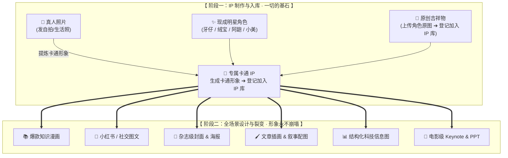

# 🎨 IP Master

### 你的专属 AI 视觉 IP 调度大师 · 形象永不走样

先制作你的专属 IP，再一键穿梭全网顶尖画风！  
**「🌱 制作卡通 IP ➔ 💾 登记加入角色库 ➔ 🚀 全场景画风裂变」**

  
  
  
  

> 💡 **IP 是一切视觉创作的基石。**  
> 制作 IP **只需一步**：将真人照片或原创设定转化为**专属卡通形象**并加入 IP 库。  
> 拥有了角色原图后，只需对 AI 说一句话，IP Master 就会把这个独一无二的角色注入到**知识漫画、小红书图文、杂志封面、文章插画、演讲 PPT**等全场景中，形象永不走样！

---

## 🧬 核心逻辑：从「IP 制作」到「全场景裂变」

---

## 🌱 第一步：制作与选择你的 IP（一切的基石）

在开始生成各种设计图片之前，先确立你的 IP 角色。制作 IP 出到卡通形象即自动入库：

### 方案 A：上传真人自拍 ➔ 生成专属卡通形象并入库
发一张真人照片，AI 自动提炼外貌特征，生成专属的 2D/3D 卡通 IP 形象，并直接登记加入你的专属角色库！

  
   
  <b>真人照片 ➔ 提炼生成专属卡通 IP 形象 ➔ 登记加入角色库（完成入库）</b>

> 💬 **制作咒语**：`"用我的这张自拍照制作个人专属 3D 卡通形象，并加入角色库命名为 [小美]"`

---

### 方案 B：直接使用 4 位常驻明星角色（开箱即用）
库中已内置 4 位常驻角色，未指定角色时默认由 **牙仔** 登场；也支持多个角色同台互动！

| 🐱 牙仔 (默认主角) | 🐰 绒宝 | 🦖 阿龅 | 👧 小美 |
| :---: | :---: | :---: | :---: |
|  |  |  |  |
| 口令：`牙仔` / `yazai` | 口令：`绒宝` / `rongbao` | 口令：`阿龅` / `abao` | 口令：`小美` / `xiaomei` |

---

### 方案 C：登记你的原创吉祥物与自创角色
已有品牌吉祥物或原创角色？发送一张原图立绘，告诉 AI *"这是我的新角色 [名字]"*，即可直接登记加入 IP 库。

---

## 🚀 第二步：全场景视觉裂变 · 看看你的 IP 能做什么？

IP 入库后，就进入了下游设计与应用环节，让角色在全网顶尖画风中自由演绎：

### 1. 📚 爆款知识漫画
多格分镜叙事、生动情绪演绎，让你的 IP 帮你讲干货！

  
   
  <b>💡 适用：科普讲解、趣味故事、行业干货</b>

---

### 2. 📱 小红书 / 社交媒体爆款图文
瑞士排版、电子杂志、手账拼贴，一秒抓住读者眼球！

| 瑞士国际主义风 (Swiss) | 电子杂志风 (Editorial) | 暖心手账拼贴风 |
| :---: | :---: | :---: |
|  |  |  |
| 强排版对比 · 极具冲击力 | 克制高级 · 生活方式与故事感 | 治愈手绘 · 亲和力拉满 |

---

### 3. 🎨 杂志级封面 & 高质感海报
从 3D 潮流质感到黏土定格、狗哥震惊体，告别千篇一律的 AI 塑料感。

| 高密度 3D 牙仔海报 | 黏土定格 3D 艺术封面 | 狗哥震惊体封面 |
| :---: | :---: | :---: |
|  |  |  |

> **竖版海报可选重排**：首稿返图后如不满意，可打开[本地排版库](ip-master/assets/layout-library/index.html)，选择编号（如 `23`）后回复“用 23 重新排版”。高密度图和其他首轮创作不会自动套用排版库。

---

### 4. 🖌️ 故事感文章配图 & 生活场景
留白叙事、真实物件融合与纸艺质感，让文章更有温度。

| 小黑怪诞手绘 (留白叙事) | 小黑实物生活场景 (牙仔与好喝的奶茶) | 纸艺拼贴艺术插画 |
| :---: | :---: | :---: |
|  |  |  |

---

### 5. 📊 结构化科技信息图
将枯燥的数据与流程，转化为极具观赏性的视觉图表。

| 霓虹等距科技信息图 | Everett 萌粒风格信息图 |
| :---: | :---: |
|  |  |

---

### 6. 📑 高质感 PPT 幻灯片
高颜值配色与版式设计，告别土味模板，让汇报大放异彩。

| 暗色电影级 Keynote 幻灯片 | 极简多色块商务 PPT |
| :---: | :---: |
|  |  |

---

## 🎯 创作者常用咒语（抄作业专区）

复制以下任意一句，直接发送给 AI 即可开始创作：

### 🧬 IP 制作阶段（生成卡通形象并入库）
- 💬 **真人转卡通 IP**：`"用我的这张自拍照生成专属 3D 卡通 IP 形象，并加入角色库命名为 [名字]"`
- 💬 **登记原创角色**：`"这是我的原创吉祥物原图，请将其加入 IP 库并命名为 [名字]"`

### 🚀 场景出图阶段（让 IP 出镜）
| 你的创作目标 | 推荐对 AI 说的话 |
| :--- | :--- |
| **小红书爆款图文** | `"用牙仔画一组小红书图文，主题是'打工人的一天'，要瑞士国际主义风"` |
| **知识漫画** | `"用绒宝画一套 4 格科普漫画，讲解什么是大语言模型"` |
| **微信公众号封面** | `"用牙仔做一张 16:9 的高密度 3D 风格科技封面，主题是'最好的IP设计工具'"` |
| **文章趣味配图** | `"用牙仔和小黑实物场景，画一张关于'喝奶茶'的 16:9 故事插画"` |
| **科技感信息图** | `"用牙仔制作一张 3:4 霓虹等距科技风格的数据流程图"` |
| **高逼格演讲 PPT** | `"用牙仔制作一组暗色 Keynote 风格的 AI 产品发布会幻灯片"` |

---

## ❤️ 致谢与开源生态

IP Master 的强大视觉表现力离不开开源社区中众多优秀创作者的智慧与灵感。特别鸣谢以下上游项目的卓越贡献：

- 👤 **Personal IP Image Pack** by [@DoraRabbitYan](https://github.com/DoraRabbitYan/personal-ip-image-pack) - 真人照片转卡通 IP 套装（IP 制作核心）
- 🎨 **Baoyu Skills** by [@JimLiu](https://github.com/JimLiu/baoyu-skills) - 涵盖知识漫画、小红书图文、编辑插画、封面与幻灯片等全能视觉套件
- 🀄 **Dongfang** by [@yang0](https://github.com/yang0/dongfang) - 东方美学与高密度 3D 视觉封面设计
- 📱 **归藏社交卡片** by [@op7418](https://github.com/op7418/guizang-social-card-skill) - 瑞士风与杂志风小红书图文、公众号封面对与动态卡
- 🐱 **Ian Xiaohei 系列** by [@helloianneo](https://github.com/helloianneo/ian-xiaohei-illustrations) - 经典怪诞手绘与实物场景插画
- 🧸 **Mini Illustration & Character System** by [@EverettFish](https://github.com/EverettFish/ip_illustration_for_yourself) - 萌粒涂鸦与文章插图系统
- 🖨️ **GBRO Cover Design** by [@pyang5166](https://github.com/pyang5166/gbro-cover-design) - 狗哥震惊体封面与海报设计
- 🌈 **Awesome GPT Image 2** by [@freestylefly](https://github.com/freestylefly/awesome-gpt-image-2) - 丰富多彩的风格增强库
- 🧩 **100 Layout Compositions** by [@nevertoday](https://github.com/nevertoday/100-layout-compositions) - 竖版海报本地排版参考库（[CC BY 4.0](https://creativecommons.org/licenses/by/4.0/)）

---

  Released under the <a href="LICENSE">MIT License</a>. Created with ❤️ for AI creators.

