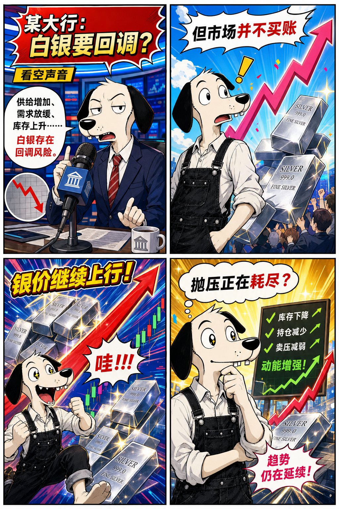
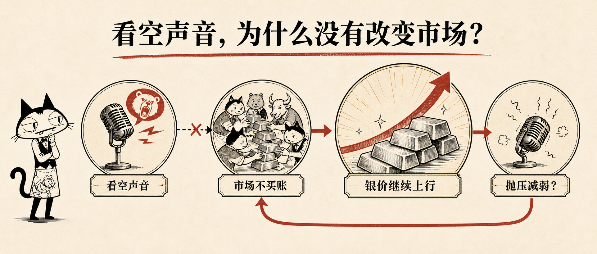
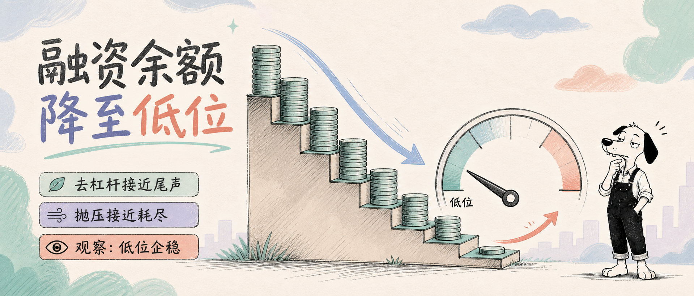
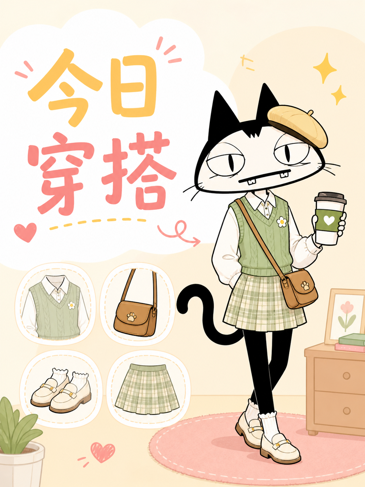
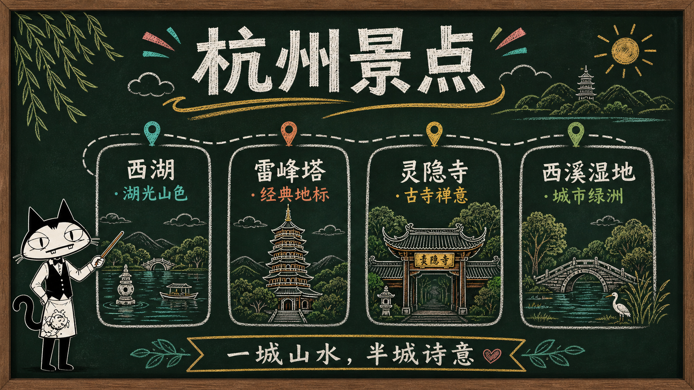
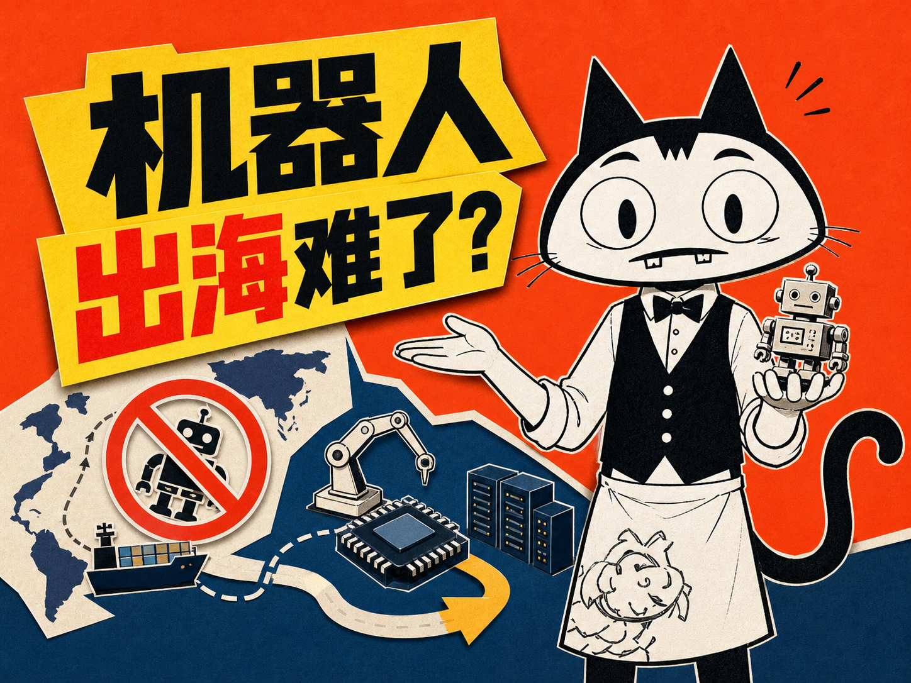
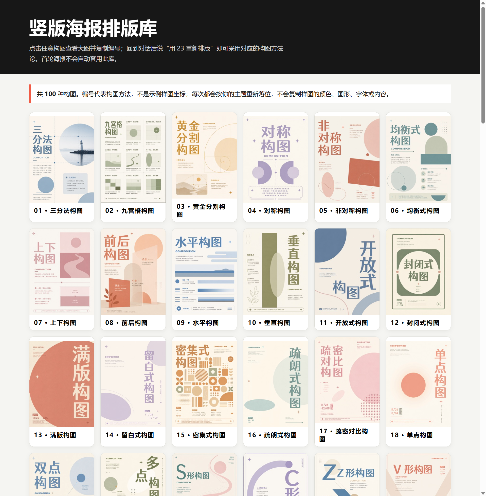
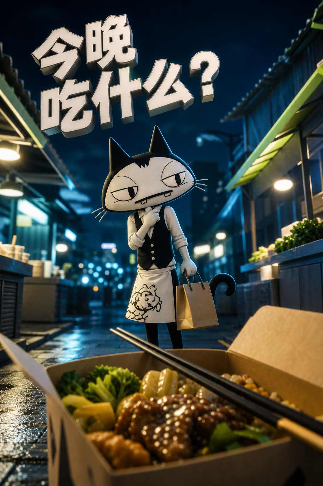
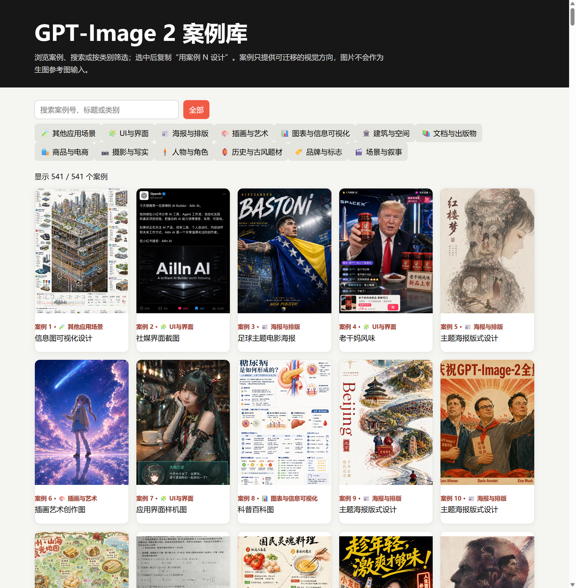
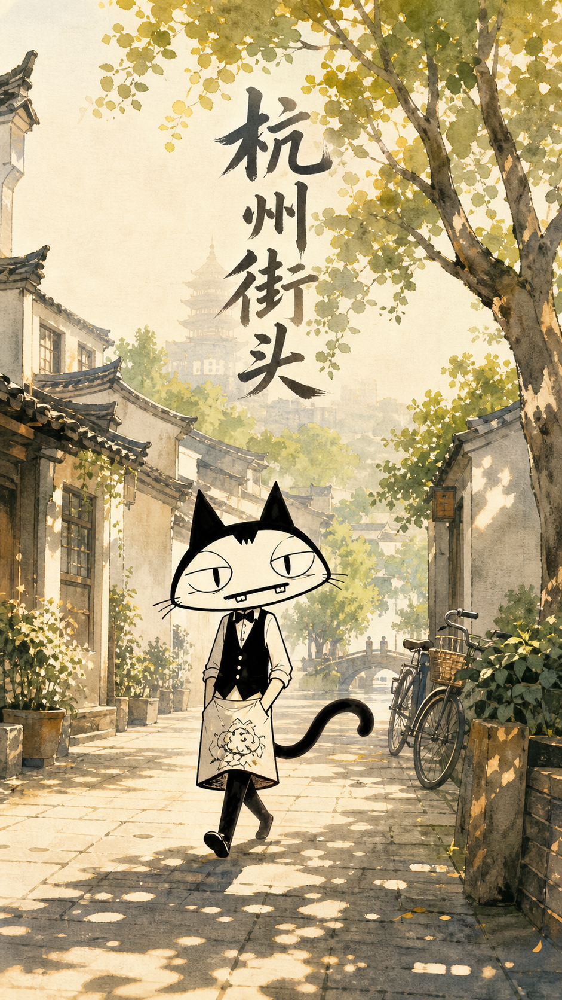

# 🎨 IP Master

把一个角色做出来，然后让它出现在任何视觉作品里。

## 1. 安装

把下面这句话连同本仓库链接一起发给 Codex：

```text
请安装这个 Skill：https://github.com/yang0/ip-master
```

## 2. 设计 IP

上传真人照片，或用账号、资料、一句话等任意形式说明需求：

```text
请根据我的照片 / 账号 / 需求，设计一个人物 IP。
```

```text
请根据我的品牌 / 账号 / 想法，设计一个吉祥物 IP。
```

| 人物 IP（[Skill](https://github.com/yang0/character-ip)） | 吉祥物 IP（[Skill](https://github.com/yang0/mascot-ip)） | 个人卡通 IP（[Skill](https://github.com/DoraRabbitYan/personal-ip-image-pack)） |
| :---: | :---: | :---: |
| <a href="https://github.com/yang0/character-ip"></a> | <a href="https://github.com/yang0/mascot-ip"></a> | <a href="https://github.com/DoraRabbitYan/personal-ip-image-pack"></a> |

## 3. 内置角色（安装好 Skill 后可以直接用）

<table width="100%">
  <tbody>
    <tr><td width="25%" align="center" valign="top"><strong>牙仔</strong></td><td width="25%" align="center" valign="top"><strong>绒宝</strong></td><td width="25%" align="center" valign="top"><strong>阿龅</strong></td><td width="25%" align="center" valign="top"><strong>小美</strong></td></tr>
    <tr><td align="center"></td><td align="center"></td><td align="center"></td><td align="center"></td></tr>
  </tbody>
</table>

## 4. 让 IP 出图

确定角色后，直接说你想要什么：

```text
用 [角色名] 做一张 [图片类型]，主题是 [主题]。
```

例如：`用牙仔做一张 3:4 海报，主题是今晚吃什么？`

<table width="100%">
  <tbody>
    <tr><td width="50%" align="center" valign="top"><strong>宝玉老师的漫画</strong></td><td width="50%" align="center" valign="top"><strong>知识漫画2</strong></td></tr>
    <tr><td align="center" valign="middle"></td><td align="center" valign="middle"></td></tr>
    <tr><td align="center" valign="bottom"><sub><span style="color:#8a8f98">这张图是让codex读取一篇长文后用牙仔生成知识图片后，codex自动选择布局和风格生成的。可以参考<a href="https://github.com/JimLiu/baoyu-skills">宝玉老师的skill</a>，指定布局和风格来制作知识卡片，（当前含<strong>6种布局</strong>和<strong>8种风格</strong>，或指定风格)。</span></sub></td><td align="center" valign="bottom"><sub><span style="color:#8a8f98">提示词：读取文章xxx，用阿龅制作知识漫画，风格：manga，基调：energetic，布局：standard。用彩色日漫四格表现“看空声音”与白银继续上行的反差。（制作漫画的参数请参考宝玉skill的<a href="https://github.com/JimLiu/baoyu-skills">readme</a>。）</span></sub></td></tr>
    <tr><td width="50%" align="center" valign="top"><strong>宝玉老师的文章插图</strong></td><td width="50%" align="center" valign="top"><strong>宝玉老师的信息图</strong></td></tr>
    <tr><td align="center" valign="middle"></td><td align="center" valign="middle"></td></tr>
    <tr><td align="center" valign="bottom"><sub><span style="color:#8a8f98">提示词：读取文章进行配图，ip: 牙仔，skill：baoyu文章插图，类型：framework，出一张就行。（skill 包含多个插图类型和画风参数，详见<a href="https://github.com/JimLiu/baoyu-skills">readme</a>。）</span></sub></td><td align="center" valign="bottom"><sub><span style="color:#8a8f98">提示词：用牙仔制作一张信息图，风格：corporate-memphis，布局：fishbone，主题：讲解 AI Agent 原理（内置<strong>20种布局</strong>和<strong>17种风格</strong>，也可以自定义）。</span></sub></td></tr>
    <tr><td width="50%" align="center" valign="top"><strong>宝玉老师的文章封面</strong></td><td width="50%" align="center" valign="top"><strong>宝玉老师的小红书封面</strong></td></tr>
    <tr><td align="center" valign="middle"></td><td align="center" valign="middle"></td></tr>
    <tr><td align="center" valign="bottom"><sub><span style="color:#8a8f98">提示词：读取文章后，用阿龅制作一张文章封面，类型：概念，配色：马卡龙，绘制媒介：手绘，图片文字：丰富，气质：平衡，字体感觉：手写（宝玉老师的文章配图skill有多个参数，具体请参考<a href="https://github.com/JimLiu/baoyu-skills">readme</a>）。</span></sub></td><td align="center" valign="bottom"><sub><span style="color:#8a8f98">提示词：用牙仔做一张小红书封面，风格：cute，布局：balanced，主题：今日穿搭（skill内置6种布局，9种风格，也可以自己设定）。</span></sub></td></tr>
    <tr><td width="50%" align="center" valign="top"><strong>宝玉老师的 PPT 演示页</strong></td><td width="50%" align="center" valign="top"><strong>狗哥的震惊体封面</strong></td></tr>
    <tr><td align="center" valign="middle"></td><td align="center" valign="middle"></td></tr>
    <tr><td align="center" valign="bottom"><sub><span style="color:#8a8f98">提示词：用牙仔做PPT（这里只展示了一页），主题：杭州景点，风格：chalkboard（宝玉老师的skill内置了<strong>16种风格</strong>的ppt，可以直接读取文章，生成<strong>多页pptx和pdf</strong>）。</span></sub></td><td align="center" valign="bottom"><sub><span style="color:#8a8f98">提示词：随机读取一篇文章，用牙仔和 gbro skill 做一张文章封面，比例：4:3，使用内置正面对视风（狗哥封面内置<strong>10种风格</strong>，具体参见<a href="https://github.com/pyang5166/gbro-cover-design#readme">README</a>）。</span></sub></td></tr>
    <tr><td width="50%" align="center" valign="top"><strong>伊恩老师的小黑配图</strong></td><td width="50%" align="center" valign="top"><strong>伊恩老师的小黑配图2.0</strong></td></tr>
    <tr><td align="center" valign="middle"></td><td align="center" valign="middle"></td></tr>
    <tr><td align="center" valign="bottom"><sub><span style="color:#8a8f98">提示词：让codex读取文章后，用绒宝+xiaohei skill为文章配图。</span></sub></td><td align="center" valign="bottom"><sub><span style="color:#8a8f98">提示词：使用IP：牙仔，skill：小黑真实物品skill，做一张 16:9 主题为奶茶的海报。</span></sub></td></tr>
    <tr><td width="50%" align="center" valign="top"><strong>高密度图</strong></td><td width="50%" align="center" valign="top"><strong>归藏老师的社媒卡</strong></td></tr>
    <tr><td align="center" valign="middle"></td><td align="center" valign="middle"></td></tr>
    <tr><td align="center" valign="bottom"><sub><span style="color:#8a8f98">提示词：用牙仔做一张 16:9 的高密度 3D 风格科技封面，主题是“最好的 IP 设计工具”（可以指定<strong>任何尺寸和风格</strong>的高密度图，也可以上传参考风格的图片）。</span></sub></td><td align="center" valign="bottom"><sub><span style="color:#8a8f98">提示词：读取xxx文档（或直接写需求），用牙仔制作一张社媒卡，使用guizang skill，风格：瑞士国际主义风（<a href="https://github.com/op7418/guizang-social-card-skill">归藏老师的skill</a>目前含<strong>6套电子杂志风和4套瑞士国际主义，适配11个小红书品类</strong>）。</span></sub></td></tr>
  </tbody>
</table>

竖版海报返图后若想换构图，可打开[本地排版库](ip-master/assets/layout-library/index.html)，回复编号即可重排。

想从 GPT-Image 2 案例中挑选视觉方向，可打开[案例选择库](ip-master/assets/gpt-image-2-case-library/index.html)，筛选或搜索后复制编号。可直接说：`用牙仔做一张海报，案例 539`；案例只迁移视觉方向，原图不会作为生图参考图输入。

### 5. 使用指定构图方式
* 输入提示词：显示排版库
* 直接排版： 用 08 进行排版，主题： xxxxxx， 使用IP： xxxx
* 对之前的图重新排版： 用 08 重新排版

| 排版库首屏视口 | “08 · 前后构图”案例 |
| :---: | :---: |
| <div align="center"></div> | <div align="center"><br><br><sub><span style="color:#8a8f98">提示词：用牙仔做一张 3:4 海报，主题是“今晚吃什么？”，用 08 前后构图的方法</span></sub></div> |

### 6. 使用 GPT-Image 2 案例库

输入提示词：`显示 GPT-Image 2 案例库`，打开[案例选择库](ip-master/assets/gpt-image-2-case-library/index.html)，按类别筛选或搜索案例，点击图片查看大图，再复制案例编号。

| 案例库首屏视口 | 用案例 495 设计杭州街头海报 |
| :---: | :---: |
| <div align="center"></div> | <div align="center"><br><br><sub><span style="color:#8a8f98">提示词：制作海报，IP：牙仔，案例 495，主题：杭州街头</span></sub></div> |

提示词：`制作海报，ip: 牙仔， 案例495， 主题：杭州街头`


当前页面收录上游可解析的 541 个案例；上游目录标注 544 个，其中 12、169、170 暂无完整画廊条目。案例内容及图片归上游和原权利人所有，商业使用前请确认授权。

## 集成 Skill 与致谢

| Skill | 能做什么 |
| :--- | :--- |
| [Character IP](https://github.com/yang0/character-ip) | 根据账号、资料、照片或需求设计人物 IP；先给 25 个候选，再按编号精修。 |
| [Mascot IP](https://github.com/yang0/mascot-ip) | 为品牌、产品和概念设计原创非人类吉祥物；先给 25 个候选，后续可扩展表情、动作和设定。 |
| [Personal IP Image Pack](https://github.com/DoraRabbitYan/personal-ip-image-pack) | 用 1–3 张授权真人照片建立个人卡通 IP；提供 6 个风格方向，并可扩展表情、动作与贴纸。 |
| [IP Illustration Character System](https://github.com/EverettFish/ip_illustration_for_yourself) | 建立角色锚点与三视图，再生成萌粒钢笔涂鸦文章配图、3:4 信息图和贴纸。 |
| [Ian Xiaohei Illustrations](https://github.com/helloianneo/ian-xiaohei-illustrations) | 为中文文章规划镜头，并生成小黑留白怪诞手绘的 16:9 正文图。 |
| [Ian Xiaohei Scenes](https://github.com/helloianneo/ian-xiaohei-scenes) | 用“小黑 + 真实物件 + 物理动作”制作 16:9 生活场景图和超横版长卷。 |
| [Baoyu Article Illustrator](https://github.com/JimLiu/baoyu-skills/tree/main/skills/baoyu-article-illustrator) | 根据文章结构生成场景插画、流程图、信息图、水彩和编辑插画，涵盖 23 种细分风格。 |
| [Baoyu Comic](https://github.com/JimLiu/baoyu-skills/tree/main/skills/baoyu-comic) | 把知识内容改造成分镜漫画，提供 5 个漫画预设、7 种版式和 7 种情绪色调。 |
| [Baoyu Cover Image](https://github.com/JimLiu/baoyu-skills/tree/main/skills/baoyu-cover-image) | 制作文章、社媒和品牌封面，支持 26 个风格预设和 7 种渲染媒介。 |
| [Dongfang Cover Design](https://github.com/yang0/dongfang) | 生成东方美学与高密度传播结构的横版封面、竖版海报和方图，共 6 类视觉方向。 |
| [GBRO Cover Design](https://github.com/pyang5166/gbro-cover-design) | 为海报 / 文章封面生成设计提示词，内置 10 种风格，具体参见 [README](https://github.com/pyang5166/gbro-cover-design#readme)。 |
| [Baoyu Infographic](https://github.com/JimLiu/baoyu-skills/tree/main/skills/baoyu-infographic) | 将数据、流程和知识转化为结构化信息图，覆盖 22 种视觉风格。 |
| [Baoyu XHS Images](https://github.com/JimLiu/baoyu-skills/tree/main/skills/baoyu-xhs-images) | 制作小红书图文与内容卡片，包含 12 种基础风格和 26 个预设。 |
| [Guizang Social Card](https://github.com/op7418/guizang-social-card-skill) | 制作瑞士国际主义 / 电子杂志社媒卡、小红书组图和公众号封面对，围绕 2 套主视觉系统。 |
| [Baoyu Slide Deck](https://github.com/JimLiu/baoyu-skills/tree/main/skills/baoyu-slide-deck) | 制作演讲和发布会幻灯片，提供 17 种视觉风格。 |
| [GPT Image 2 Style Library](https://github.com/freestylefly/awesome-gpt-image-2) | 为生图请求匹配风格模板、补全提示词，收录 500+ 案例模板。 |
| [100 Layout Compositions](https://github.com/nevertoday/100-layout-compositions) | 竖版海报返图后可按 100 个编号构图方法重新排版，并提供本地离线画廊。 |

<sub>Released under the <a href="LICENSE">MIT License</a>.</sub>
